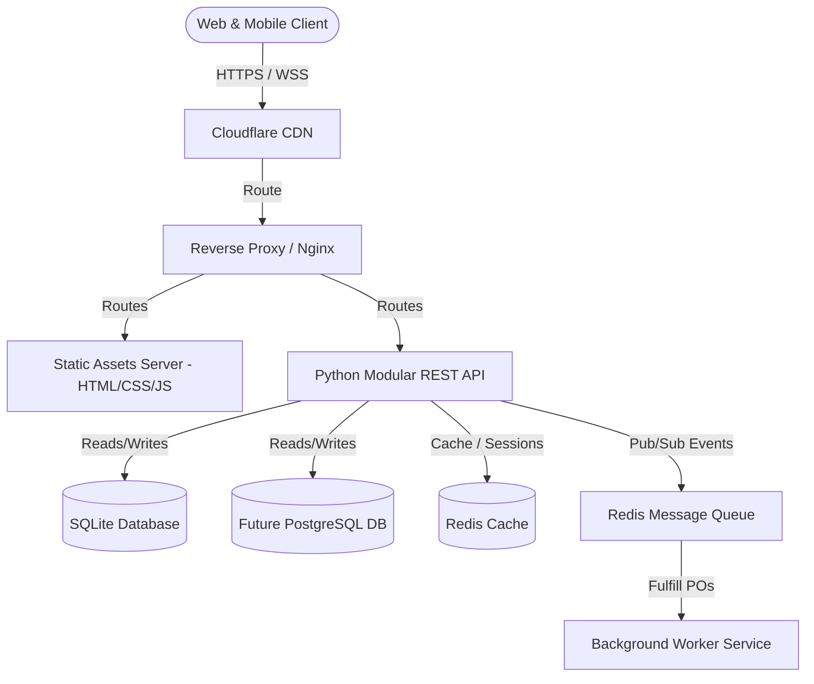

# KitchenOS: Project Architecture & Engineering Overview

**Purpose**: High-level architectural specification, engineering guidelines, vision, and system boundaries for the KitchenOS application.  
**Version**: 1.0.0  
**Author**: KitchenOS Core Engineering Team  
**Last Updated**: July 6, 2026  

---

## Table of Contents
1. [Project Vision & Business Goal](#1-project-vision--business-goal)
2. [Target Users & Personas](#2-target-users--personas)
3. [Scope Statement](#3-scope-statement)
4. [High-Level Architecture](#4-high-level-architecture)
5. [Technology Stack](#5-technology-stack)
6. [Engineering Standards & Git Workflow](#6-engineering-standards--git-workflow)
7. [Operational Strategy (CI/CD & Deployment)](#7-operational-strategy-cicd--deployment)
8. [Cross-Cutting Concerns (Security, Scalability, Performance)](#8-cross-cutting-concerns-security-scalability-performance)
9. [Documentation & Testing Strategy](#9-documentation--testing-strategy)
10. [Release Roadmap & Future Enhancements](#10-release-roadmap--future-enhancements)

---

## 1. Project Vision & Business Goal

### Project Vision
KitchenOS is an enterprise-grade Kitchen Management System (KMS) designed to unify commercial kitchen operations. It integrates real-time inventory management, automated recipe costing, supplier communication, and point-of-sale (POS) systems into a single, cohesive portal. By providing a unified dashboard, KitchenOS eliminates operational inefficiencies, reduces food waste, and guarantees high food safety standards.

### Business Goal
*   **Reduce Food Waste**: Lower ingredient waste by 15-20% through intelligent inventory forecasting.
*   **Improve Cost Management**: Automate recipe costing and raw material price monitoring to maintain profit margins.
*   **Streamline Operations**: Reduce manual inventory check times by 50% via automated supplier order sheets.
*   **Ensure Compliance**: Digitize HACCP logs to achieve 100% compliance readiness.

---

## 2. Target Users & Personas

KitchenOS is built for distinct user groups, each interacting with specific modules:

*   **Executive Chef / Kitchen Manager**: Manages recipes, costs, inventory levels, and approves ordering.
*   **Prep/Line Cooks**: Accesses digitized recipes, updates prep counts, and logs food storage temperatures (HACCP).
*   **Restaurant Owner / Operations Director**: Monitors multi-site analytics, profit margins, and supplier performance.
*   **Supplier / Vendor Accounts**: Interacts with the procurement module to fulfill purchase orders.

---

## 3. Scope Statement

### In Scope for Version 1.0
*   **Identity & Access Management (IAM)**: OAuth2/JWT-based role-based access control (RBAC).
*   **Recipe & Costing Module**: Multi-level recipe database with scaling, automatic ingredient cost aggregation, and prep instructions.
*   **Inventory & Supplier Management**: Real-time stock counts, FIFO storage tracking, automated reorder thresholds, and PO generation.
*   **HACCP & Compliance Logging**: Digital temperature logs, sanitization records, and warning alerts for out-of-spec items.
*   **POS Integration Gateway**: Synchronous sales deduction framework to decrease stock levels as menu items sell.
*   **Reporting & Analytics Dashboard**: Profit margins, waste metrics, and ordering history.

### Out of Scope (Future Phases)
*   **IoT Sensors Integration**: Automated temperature sensing via hardware Bluetooth/WiFi thermometers (simulated in v1.0).
*   **AI-Powered Predictive Ordering**: Machine learning demand-forecasting models.
*   **Multi-brand Corporate Billing**: Enterprise franchise finance consolidation tools.

---

## 4. High-Level Architecture

KitchenOS adopts a **modular monolith architecture** separating concerns between the client browser interface and a Python REST API service.



### Core Architecture Principles
1.  **Separation of Concerns**: Clean separation between frontend layout assets and backend business logic.
2.  **API-First Design**: The frontend communicates solely with the backend via OpenAPI-compliant RESTful endpoints and WebSockets for real-time updates.
3.  **Modular Monolith**: Clean organization of API routes, services, schemas, models, and utilities on the backend.

---

## 5. Technology Stack

### Frontend Architecture
*   **Structure & Presentation**: Semantic HTML5 markup.
*   **Styling**: CSS3 powered by Tailwind CSS for custom utility layouts.
*   **Logic**: Vanilla JavaScript (ES6+), adopting native DOM operations and event listeners. No frameworks (No React, Angular, Vue, Next.js, Bootstrap).
*   **Build Tooling**: PostCSS and Tailwind CLI compiler.

### Backend Architecture
*   **Language**: Python.
*   **Framework**: Modular REST API architecture with explicit paths separating routes, services, models, database schemas, and utilities.
*   **Event Handling**: Celery + Redis for asynchronous task execution (email generation, export tasks).

### Database Architecture
*   **Development**: SQLite for serverless simplicity and quick integration.
*   **Production/Future**: Configured to migrate to PostgreSQL via environment adapters.
*   **Migrations**: Alembic or custom schema migration runner scripts.

### Testing & Automation
*   **API Verification**: Postman collections, environment configurations, and automated Postman test scripts.
*   **E2E Framework**: Playwright (JavaScript) using the Page Object Model (POM) pattern for multi-browser, automated cross-device flow verification.

---

## 6. Engineering Standards & Git Workflow

### Coding Standards
*   **Backend**: PEP 8 compliance, type hinting, formatting via Black, and linting via Ruff.
*   **Frontend**: ESLint with vanilla JS rules, Tailwind classes ordering formatting.

### Naming Conventions
*   **Files/Folders**: `snake_case` for Python backend files; `kebab-case` or `snake_case` for HTML/CSS/JS frontend files.
*   **Database Tables**: `snake_case` pluralized (e.g., `recipes`, `menu_items`).
*   **API Routes**: `kebab-case` pluralized (e.g., `/api/v1/recipe-management`).

### Git Workflow & Branching Strategy
We use a structured **Git Flow** strategy.
*   `main`: Holds the current production-ready code.
*   `develop`: The integration branch for current sprint features.
*   `feature/sprint-[X]-[story-name]`: Individual developer branches spawned from `develop`.
*   `release/v[X.Y.Z]`: Release prep branches.

---

## 7. Operational Strategy (CI/CD & Deployment)

### CI/CD Pipeline Overview
*   **Stage 1: Lint & Validate**: ESLint, Prettier, Black, and Ruff check scripts.
*   **Stage 2: API & Integration Tests**: Running Postman automated collections CLI tests (Newman) and Playwright E2E suites.
*   **Stage 3: Staging Deploy**: Code compiled and updated on staging webservers on merge to `develop`.
*   **Stage 4: Production Deploy**: Deploy to production cloud instances on merge to `main`.

---

## 8. Cross-Cutting Concerns

### Security
*   **Data in Transit**: HTTPS (TLS 1.3) enforced globally.
*   **OWASP Protections**: Explicit mitigation of SQL Injections (parameterized SQLite/PostgreSQL bindings) and XSS (sanitizing text inputs before DOM insertion).

### Scalability
*   **Modular Design**: Clean decoupling between backend utility services enables straightforward migration of database layers from SQLite to PostgreSQL.

---

## 9. Documentation & Testing Strategy

### Documentation Strategy
*   **API Specs**: Standard OpenAPI documentation and Postman Collections documentation page.
*   **Architecture & Sprints**: Version-controlled markdown documents inside `docs/` detailing all design choices.

### Testing Strategy
*   **API Tests**: Postman runner testing assertions for status codes, schema layouts, and response parameters.
*   **E2E Tests**: Playwright scripts testing user-facing journeys (e.g., login, inventory adjustments) in Chromium, WebKit, and Firefox.

---

## 10. Release Roadmap & Future Enhancements

```
Phase 0           Phase 1           Phase 2            Phase 3
[Planning] ----> [Foundation] ----> [Auth & CRUD] ----> [v1.0 Production]
  Sprint 0          Sprint 1-2        Sprint 3-5         Sprint 6-8
```

### Roadmap Milestones
*   **v0.1**: Core workspace structure, HTML layout template, SQLite DB setup, baseline health check endpoints (Sprint 1).
*   **v0.2**: User sessions management, JWT tokens checking, database models for recipes and inventory (Sprint 2-3).
*   **v0.5**: Cost costing calculation, webhooks receiver for POS, compliance temperature logging (Sprint 4-5).
*   **v1.0**: Automated system testing via Playwright JS, Postman collections integration, production deployment (Sprint 6-8).
