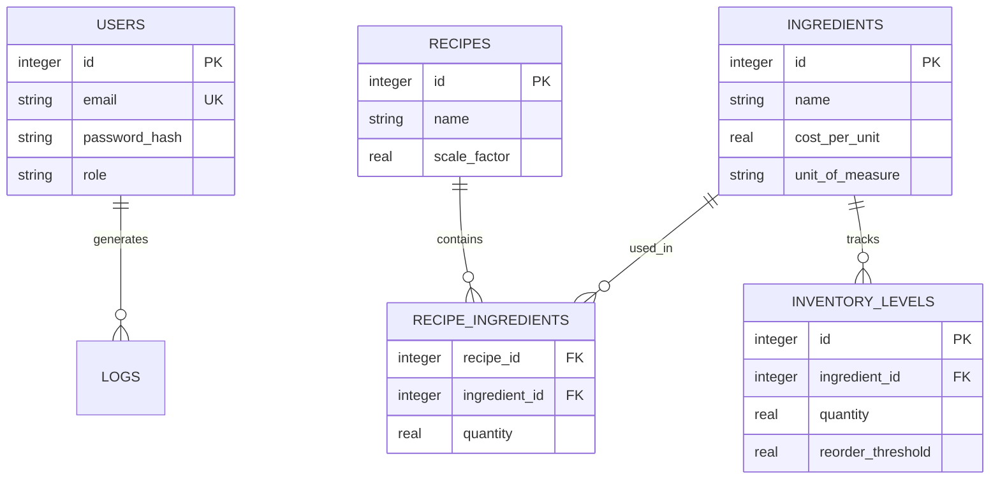

# Database Architecture Specification

**Purpose**: SQLite schema layouts, database engine settings, query indexing, and PostgreSQL migration rules.  
**Version**: 1.0.0  
**Author**: KitchenOS Core Engineering Team  
**Last Updated**: July 6, 2026  

---

## Table of Contents
1. [Database Engine Selection](#1-database-engine-selection)
2. [Entity-Relationship Diagram (ERD)](#2-entity-relationship-diagram-erd)
3. [Schema Catalog Tables](#3-schema-catalog-tables)
4. [Indexing & Query Optimizations](#4-indexing--query-optimizations)
5. [Database Migrations & PostgreSQL Adaptation](#5-database-migrations--postgresql-adaptation)
6. [Data Caching Strategy](#6-data-caching-strategy)

---

## 1. Database Engine Selection

KitchenOS utilizes **SQLite** for development and local testing.

### Rationale:
*   **Zero Administration**: SQLite requires no background service process, simplifying local development setup.
*   **Performance**: Extremely fast for single-user development workloads.
*   **Portability**: The database is stored in a single file inside the repository.

### Production Migration Strategy:
To support migration to **PostgreSQL**, database interfaces use standardized SQL queries that avoid database-specific dialects.

---

## 2. Entity-Relationship Diagram (ERD)

The database schema manages relationships across core entities:

---

## 3. Schema Catalog Tables

### Table: `users`
*   `id`: `INTEGER` (Primary Key, Autoincrement)
*   `email`: `TEXT` (Unique, Not Null)
*   `password_hash`: `TEXT` (Not Null)
*   `role`: `TEXT` (Not Null - `admin`, `chef`, `cook`)
*   `created_at`: `TEXT` (ISO8601 UTC timestamp)

### Table: `recipes`
*   `id`: `INTEGER` (Primary Key, Autoincrement)
*   `name`: `TEXT` (Not Null)
*   `description`: `TEXT`
*   `prep_time_minutes`: `INTEGER`
*   `yield_portions`: `INTEGER`

### Table: `recipe_ingredients`
*   `recipe_id`: `INTEGER` (Foreign Key -> `recipes.id` ON DELETE CASCADE)
*   `ingredient_id`: `INTEGER` (Foreign Key -> `ingredients.id`)
*   `quantity`: `REAL` (Not Null)

---

## 4. Indexing & Query Optimizations

To optimize SQLite performance:

1.  **Write-Ahead Logging (WAL)**:
    *   Enable WAL mode to support concurrent read and write operations: `PRAGMA journal_mode=WAL;`
2.  **Foreign Key Support**:
    *   Enable foreign key constraints explicitly for each database connection: `PRAGMA foreign_keys=ON;`
3.  **Indexing**:
    *   Create indices on fields used in lookups and search queries: `CREATE INDEX idx_recipes_name ON recipes(name);`

---

## 5. Database Migrations & PostgreSQL Adaptation

### Migration Guidelines:
*   SQLite schemas are defined in `database/schema.sql`.
*   A custom migration runner script (`database/migration.py`) executes schema updates sequentially.

### PostgreSQL Compatibility Rules:
*   Use standard SQL types that map directly to PostgreSQL types (e.g. `INTEGER` maps to `integer`, `TEXT` to `text` or `varchar`).
*   Avoid SQLite-specific features like `AUTOINCREMENT` on fields that don't require it, as standard PostgreSQL uses `SERIAL` or `GENERATED ALWAYS AS IDENTITY`.
*   Dates and times are stored as ISO8601 text strings (`YYYY-MM-DD HH:MM:SS`), which PostgreSQL can parse into timestamp fields.
