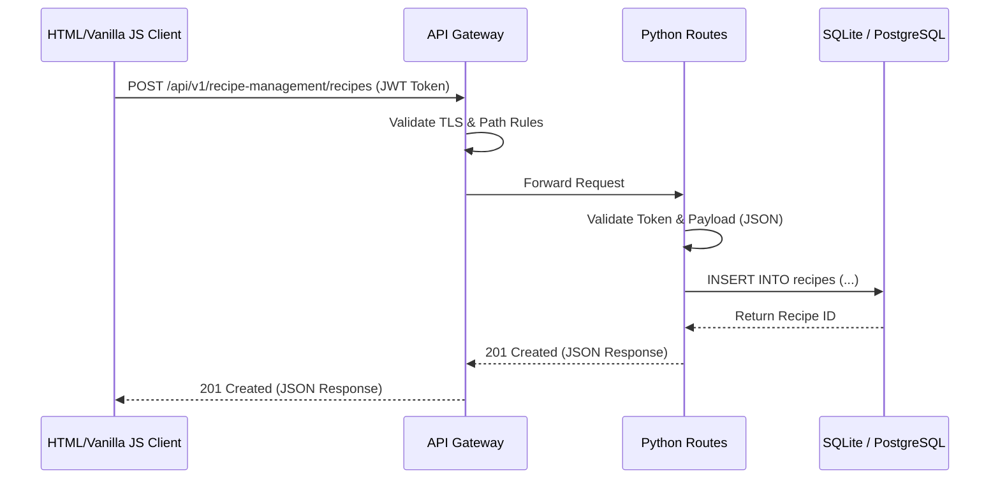
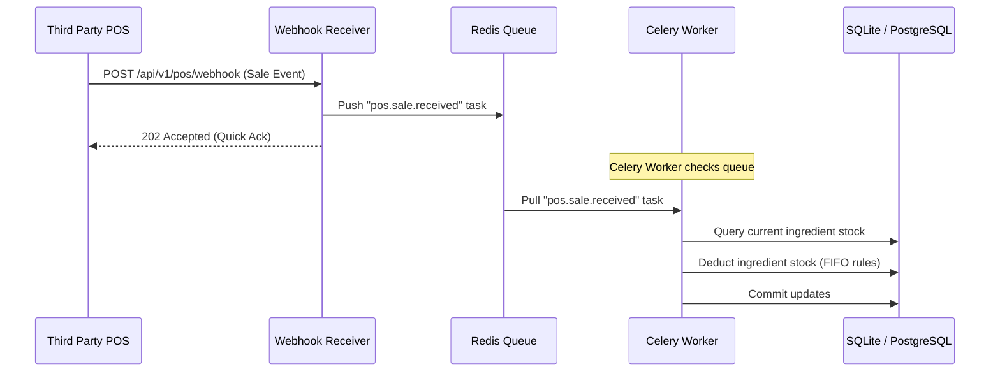

# System Architecture Specification

**Purpose**: High-level system-wide structural components, communication flows, and system scalability.  
**Version**: 1.0.0  
**Author**: KitchenOS Core Engineering Team  
**Last Updated**: July 6, 2026  

---

## Table of Contents
1. [Executive Summary](#1-executive-summary)
2. [Logical Architecture Layers](#2-logical-architecture-layers)
3. [Physical Topology](#3-physical-topology)
4. [Component Communication Patterns](#4-component-communication-patterns)
5. [Design Decisions & Trade-Offs](#5-design-decisions--trade-offs)
6. [Security & Network Isolation](#6-security--network-isolation)

---

## 1. Executive Summary

KitchenOS relies on a modular monolith architectural style with clear logical micro-services layers. This structure guarantees quick data exchange during daily kitchen operations, while enabling future microservices separation when scaling specific high-load units (e.g., POS ingestion and reporting).

---

## 2. Logical Architecture Layers

The logical layers of the system separate user interface presentation, API orchestration, and core business processing:

```mermaid
graph TD
    UI[Frontend Client: HTML5 / Tailwind / Vanilla JS] --> |REST/WS APIs| Gateway[API Gateway - Nginx]
    
    subgraph Modular Monolith Backend (Python)
        Gateway --> |Routes| Routes[API Routes Controller]
        Routes --> |Calls Services| Services[Business Services]
    end
    
    subgraph Data & Message Broker
        Services --> |ORM / SQL| DB[(SQLite / PostgreSQL)]
        Services --> |Cache / Sessions| Redis[(Redis Cache)]
        Services --> |Publishes Events| Queue[Redis Message Queue]
        Queue --> |Dequeues| Worker[Celery Background Worker]
        Worker --> |Saves Output| DB
    end
```

### Component Details
*   **Presentation Layer (HTML5/Tailwind/Vanilla JS)**: Serves static markup styled with Tailwind CSS, utilizing Vanilla JavaScript module components for dynamic rendering and event handling.
*   **Gateway Layer (Nginx)**: Manages TLS termination, acts as a reverse proxy, and implements path-based routing (e.g., routing `/api/v1/auth/*` to the auth routes).
*   **Application Layer (Python Modular Monolith)**: Uses explicit routing classes, service operators, entity models, and utilities folders.
*   **Async Processing (Celery & Redis)**: Offloads compute-heavy processes (generating PDFs, sending notifications, and running calculations) from the synchronous HTTP request-response thread.

---

## 3. Physical Topology

The hosting architecture is designed for high availability and failover:

1.  **Anycast DNS (Cloudflare)**: Resolves requests, filters out malicious bots (DDoS mitigation), and serves cached media.
2.  **App Pods (Docker Containers)**: Multi-instance deployment running across availability zones. Controlled by load balancers with health check monitoring.
3.  **Database Instance**:
    *   *Development*: Lightweight local SQLite container database.
    *   *Production/Staging*: Managed PostgreSQL Database with Multi-AZ deployment for failover.

---

## 4. Component Communication Patterns

### Synchronous Requests (REST API)
Standard user-triggered interactions use HTTP REST calls:


### Asynchronous Event Processing (Pub/Sub)
For operations like receiving POS sale events that adjust inventory limits:


---

## 5. Design Decisions & Trade-Offs

### Decision: Vanilla JS + Tailwind vs. SPA Framework (Next.js/React)
*   **Pros**: Zero runtime compilation dependencies, smaller Javascript bundles, lightning fast loading times, and direct layout control without virtual DOM abstractions.
*   **Cons**: Dynamic UI rendering requires manual DOM updates in JavaScript, and component modularity must be implemented without component libraries.

### Decision: SQLite for Development vs. PostgreSQL directly
*   **Pros**: Zero installation friction, file-based storage simplifies automated local integration testing, and fits within resources limits.
*   **Cons**: Lacks advanced PostgreSQL features (e.g. native JSONB indexing), requiring modular schema designs that remain compatible with both database engines.

---

## 6. Security & Network Isolation

*   **VPC Peering**: Database and caching instances are placed inside a private subnet inaccessible from the public internet.
*   **Least Privilege**: IAM database users are given permissions matching their functional needs (e.g., Reporting Service database user only has read permissions).
